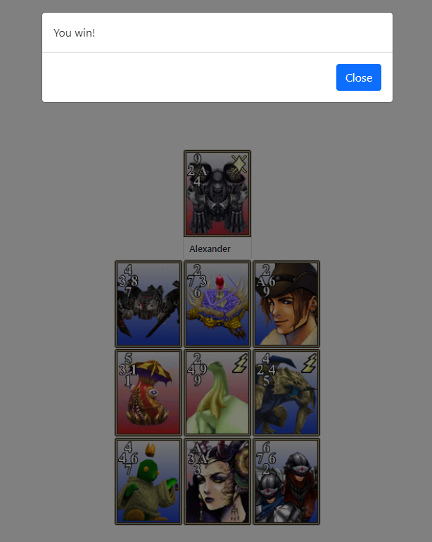

## About Triple Triad Collection

This is my first bigger ReactJS project. I made this app to learn how to use React more diversely.

Originally I was just going to make a small app that would let you collect cards/keep track of owned cards for the FF8 minigame Triple Triad. 

I later decided to try and make this a clone of the actual minigame.


The game is somewhat playable, but currently the opponent AI is very simple. It's like playing chess with a chicken but worse... so yeah, this is still quite a work in progress. :D





### Known bugs
```
- Breaks if you place cards on the gameboard too fast
- Not responsive atm
```

### Incomplete features
```
- Different game rules
- Victory trade rules
- Change cards in hand
```
### Future improvements
```
- Actually smart AI
- UI improvement
```
